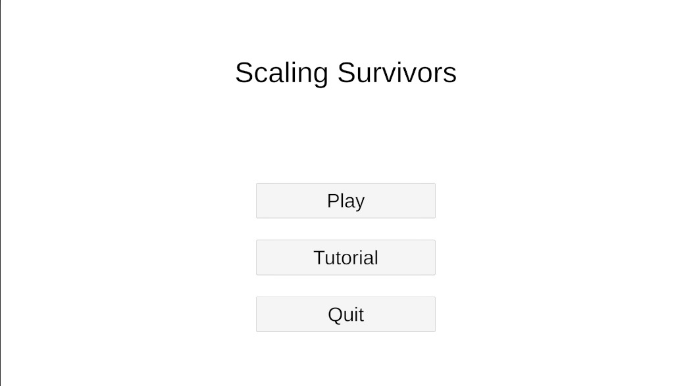
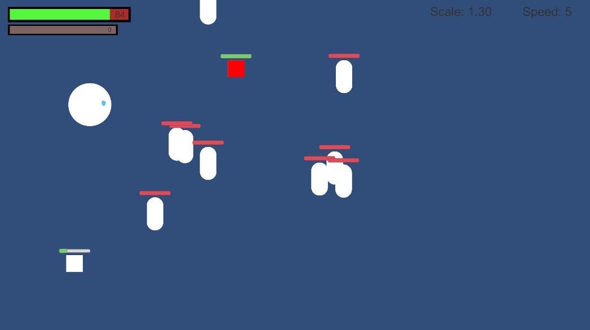
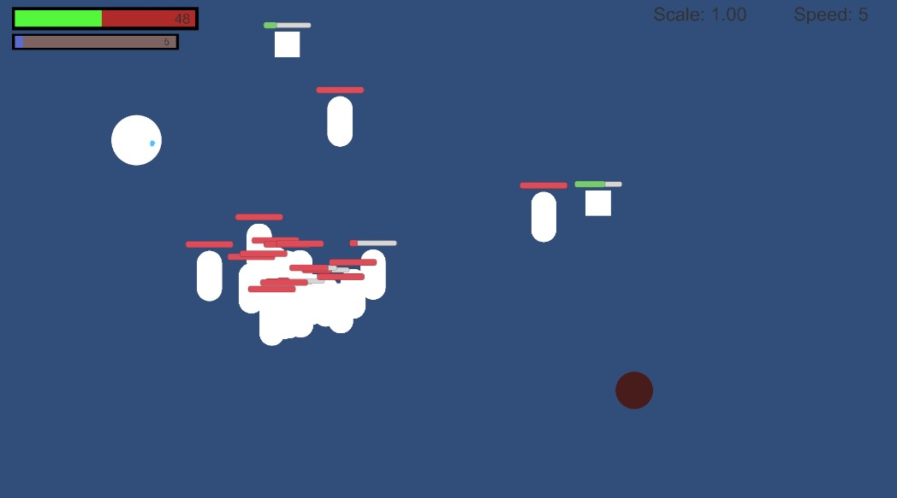

# gmtk-gamejam
## scaling survivors
In this game, the player must balance offensive and defensive strategies to survive. As the player shoots, their character gradually scales down in size, making it crucial to manage resources effectively. To regain health and increase in size, the player can consume food scattered throughout the game world. Enemies are constantly approaching, adding to the challenge.

The player can perform two types of attacks: a normal attack, triggered with the left mouse button, and a powerful big attack, triggered with the right mouse button. However, to unleash the big attack, the player must first grow large enough by consuming food.

There are three types of food available in the game:

White Food: This restores a small amount of health and slightly increases the player's size.

Red Food: This provides a significant boost to both health and size, helping the player recover faster.

Blue Food: This temporarily increases the player's speed, allowing for quick maneuvers or evading enemies.

Managing these elements—attacks, size, and speed—is key to surviving and progressing in the game.

Game has lots of incomplete parts. Game closes when your health goes under 0.

[Itch.io page](https://vitaesmorte.itch.io/scaling-survivors)

## images

## To-Do
- [x] Create player and movement
- [x] Create food spawner and simple food mechanic
- [x] Create enemy spawner
- [x] Create enemy movement
- [x] Create ability to pick food and growth
- [x] Create ability to shoot enemies and shrink
- [x] Create health bar for player
- [x] Create enemy to hit player mechanic
- [ ] Create death game over screen
- [x] Create exp system
- [ ] Create ability to level up
- [ ] Dash mechanic for player
- [x] Create different food types with different effects
- [ ] Create different enemy types
- [ ] Create different player skins
- [ ] Extra abilities for player when leveling up (Choosing between different abilities)
- [x] Create secondary weapon